# アーキテクチャ図（Mermaid版）

このファイルには、Performance Observatoryプロジェクトの主要なアーキテクチャ図をMermaid形式で記載しています。

---

## 目次

1. [全体アーキテクチャ](#1-全体アーキテクチャ)
2. [レンダリングパターンの比較](#2-レンダリングパターンの比較)
3. [データフロー図](#3-データフロー図)
4. [パターン選択フローチャート](#4-パターン選択フローチャート)
5. [スケールアップアーキテクチャ](#5-スケールアップアーキテクチャ)
6. [キャッシュ戦略](#6-キャッシュ戦略)
7. [エラーハンドリング階層](#7-エラーハンドリング階層)

---

## 1. 全体アーキテクチャ

### システム全体構成

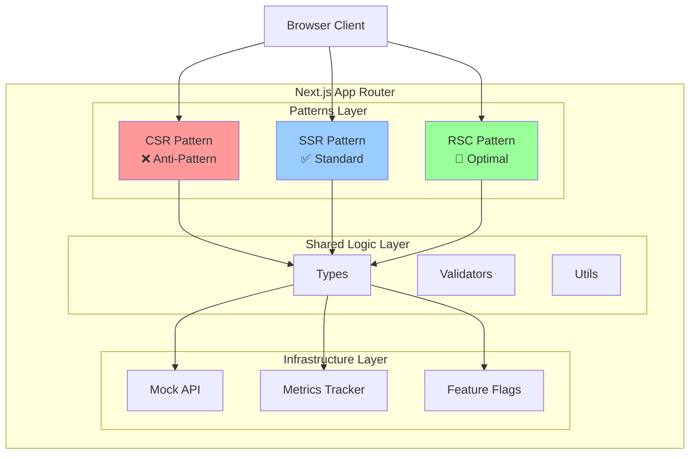

### コンポーネント階層

```mermaid
graph LR
    subgraph "App Directory"
        Layout[layout.tsx<br/>Root Layout]
        Page[page.tsx<br/>Home]
        Patterns[/patterns/<br/>Route Group]
    end
    
    subgraph "Pattern Implementations"
        CSRPage[csr-anti/page.tsx]
        SSRPage[ssr-standard/page.tsx]
        RSCPage[rsc-optimal/page.tsx]
    end
    
    subgraph "Components"
        ServerComp[Server Components]
        ClientComp[Client Components<br/>'use client']
        HybridComp[Hybrid Components]
    end
    
    Layout --> Page
    Layout --> Patterns
    Patterns --> CSRPage
    Patterns --> SSRPage
    Patterns --> RSCPage
    
    CSRPage --> ClientComp
    SSRPage --> ServerComp
    SSRPage --> ClientComp
    RSCPage --> ServerComp
    RSCPage --> HybridComp
    
    style CSRPage fill:#ff9999
    style SSRPage fill:#99ccff
    style RSCPage fill:#99ff99
```

---

## 2. レンダリングパターンの比較

### リクエストフロー比較

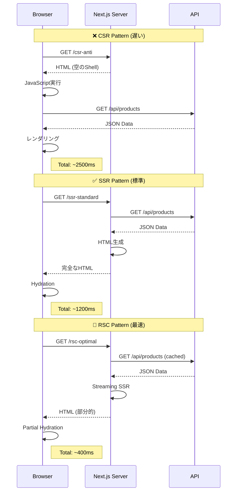

### パフォーマンス比較

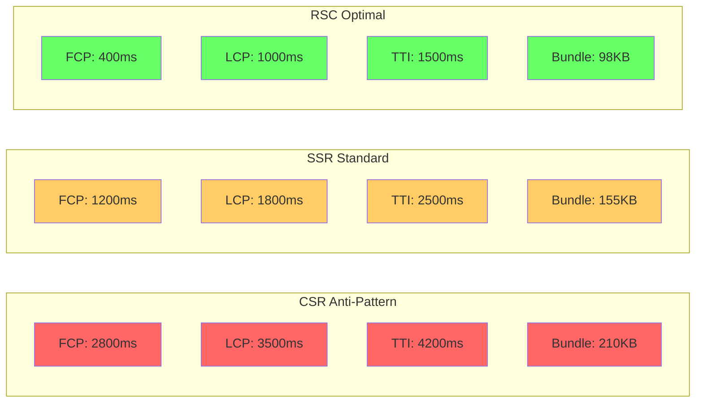

---

## 3. データフロー図

### CSR パターンのデータフロー

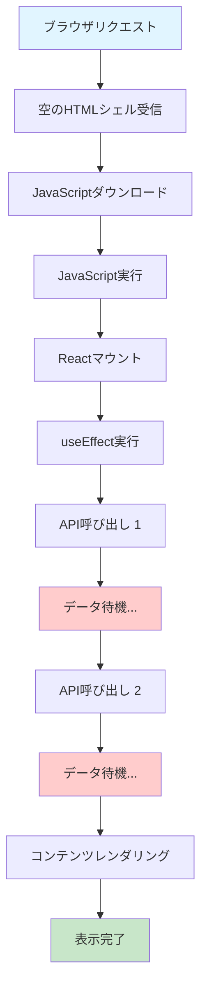

### SSR パターンのデータフロー

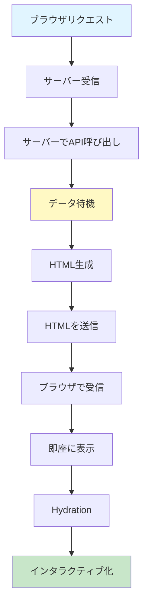

### RSC パターンのデータフロー（最適）

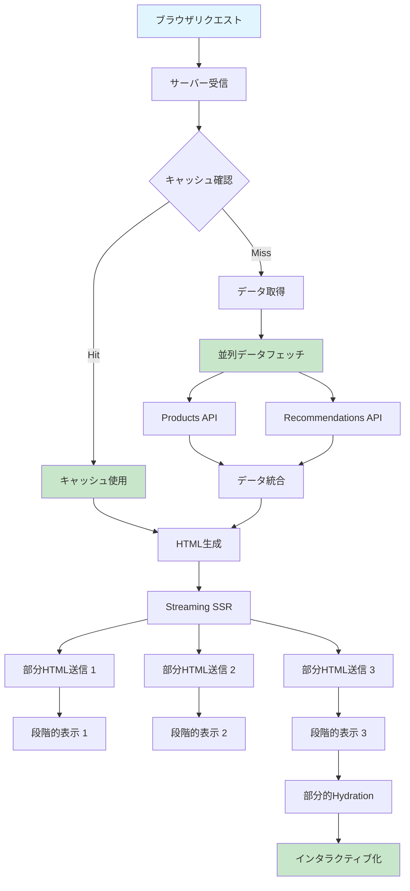

---

## 4. パターン選択フローチャート

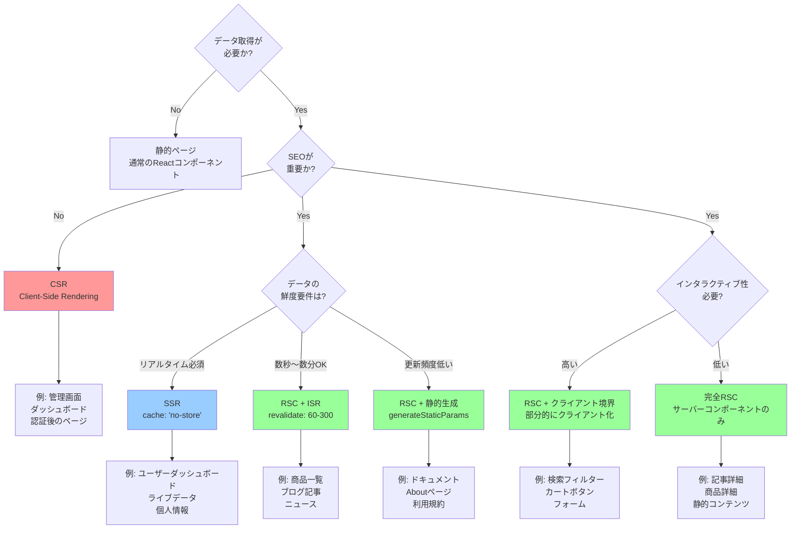

### ユースケース別推奨パターン

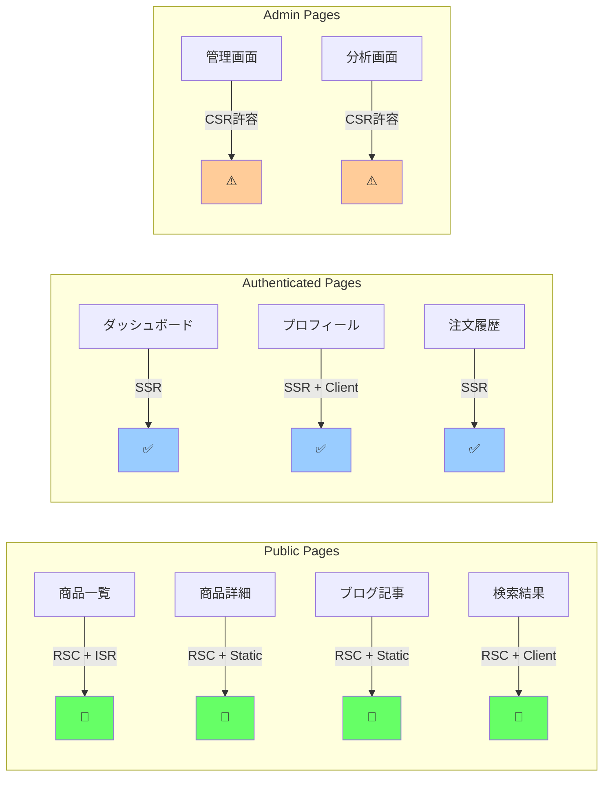

---

## 5. スケールアップアーキテクチャ

### フェーズ1: 初期（〜1万PV/日）

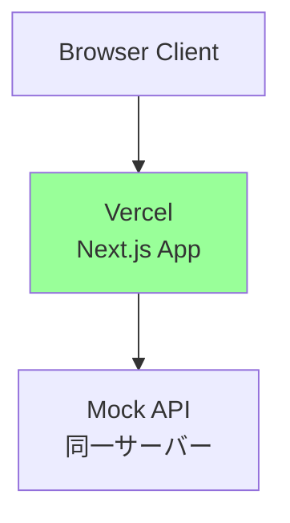

### フェーズ2: 成長期（1万〜10万PV/日）

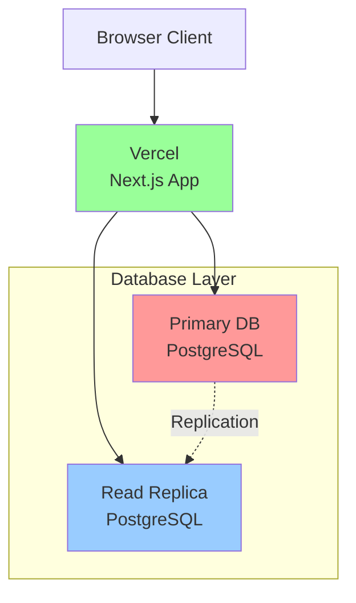

### フェーズ3: 拡張期（10万〜100万PV/日）

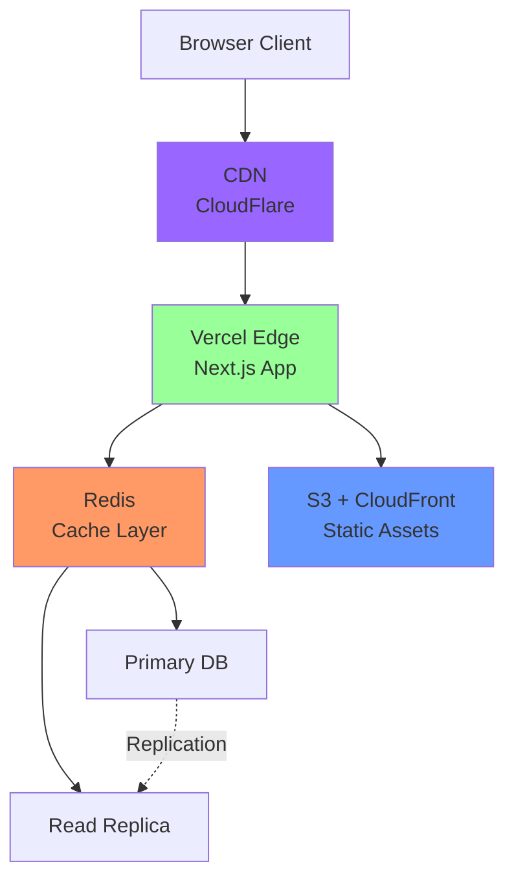

### フェーズ4: スケール期（100万PV/日〜）

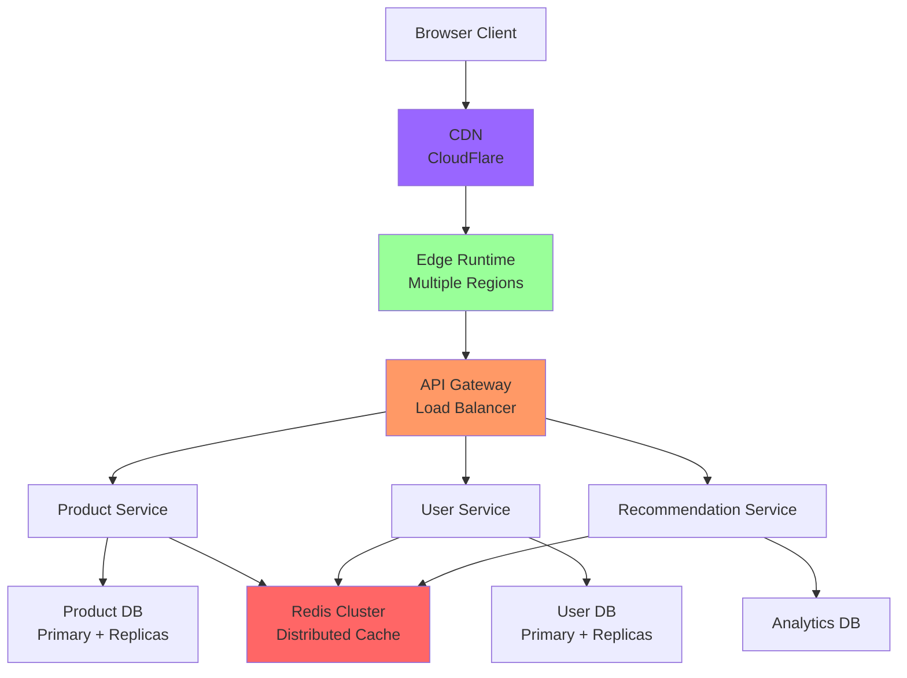

---

## 6. キャッシュ戦略

### キャッシュ階層

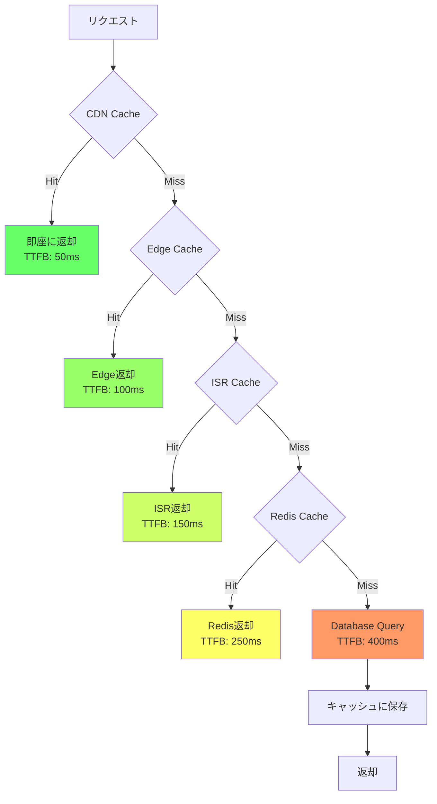

### キャッシュ戦略マトリックス

```mermaid
quadrantChart
    title キャッシュ戦略選択
    x-axis 低頻度更新 --> 高頻度更新
    y-axis 低重要度 --> 高重要度
    quadrant-1 短期キャッシュ + タグ
    quadrant-2 no-cache (SSR)
    quadrant-3 長期キャッシュ (静的生成)
    quadrant-4 中期キャッシュ (ISR)
    
    商品画像: [0.8, 0.3]
    商品一覧: [0.6, 0.7]
    商品詳細: [0.7, 0.6]
    ユーザー情報: [0.3, 0.9]
    在庫数: [0.2, 0.8]
    おすすめ: [0.5, 0.5]
    ブログ記事: [0.9, 0.6]
    利用規約: [0.95, 0.4]
```

---

## 7. エラーハンドリング階層

### エラー境界の構造

```mermaid
graph TD
    Root[Root Error Boundary<br/>app/error.tsx] --> Pattern[Pattern Error Boundary<br/>app/patterns/error.tsx]
    
    Pattern --> CSRError[CSR Error Boundary<br/>csr-anti/error.tsx]
    Pattern --> SSRError[SSR Error Boundary<br/>ssr-standard/error.tsx]
    Pattern --> RSCError[RSC Error Boundary<br/>rsc-optimal/error.tsx]
    
    RSCError --> ProductError[Product Error Boundary<br/>products/[id]/error.tsx]
    
    ProductError --> Component[Component Level<br/>try/catch]
    
    style Root fill:#ff6666
    style Pattern fill:#ff9966
    style RSCError fill:#ffcc66
    style ProductError fill:#ffff66
    style Component fill:#ccff66
```

### エラーフロー

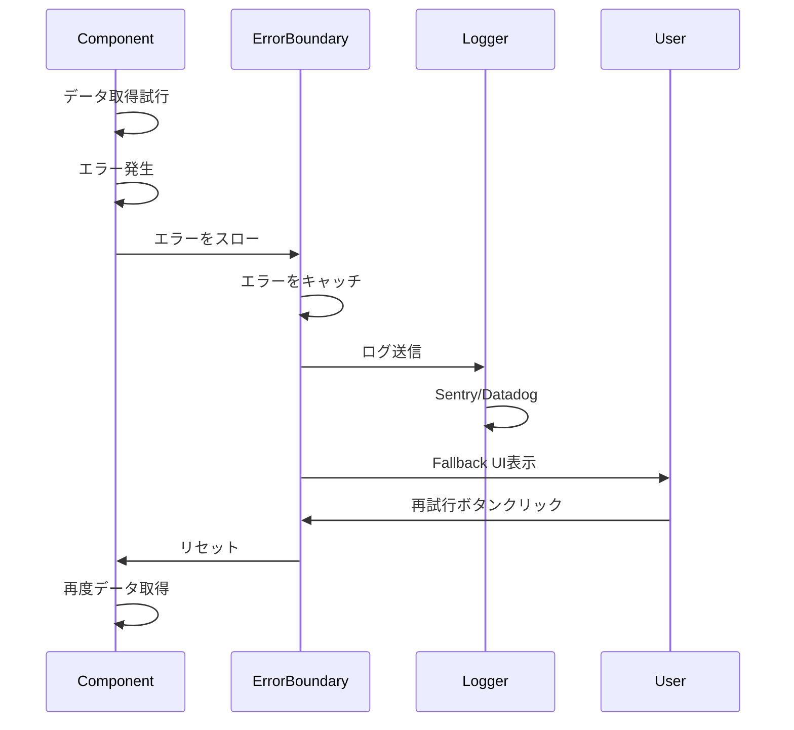

---

## 8. デプロイメントフロー

### CI/CDパイプライン

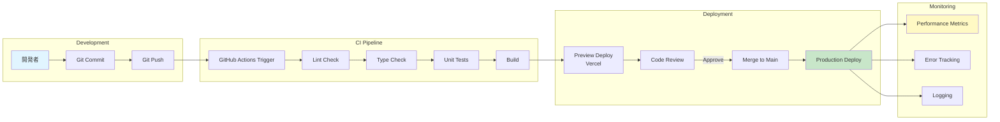

### カナリアデプロイメント

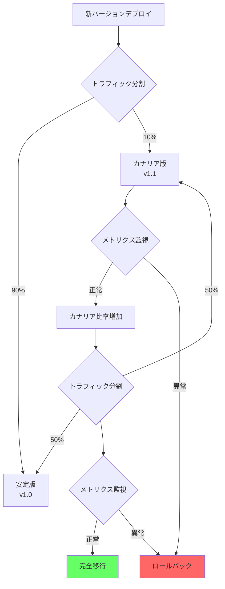

---

## 使用方法

これらのMermaid図は、以下の場所で使用できます：

1. **GitHub**: README.mdやドキュメントに直接埋め込み
2. **Notion**: Mermaid対応のコードブロック
3. **VS Code**: Mermaid Preview拡張機能
4. **Mermaid Live Editor**: https://mermaid.live/

### 埋め込み例

````markdown
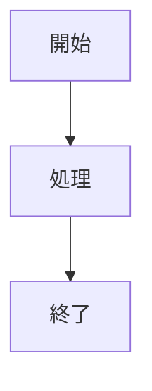
````

これでアーキテクチャの可視化が完成です！
